# Docker
- Resource: https://learn.cantrill.io/courses/docker-fundamentals/lectures/44151189

## Introduction

**Physical Servers vs Virtual Machines**

From top to bottomw

<u>Physical Servers</u>
- Application Layer
- Runtime Environment, Dependencies & Libraries
- Operating System (Windows, Linux, MacOS)

<u>Virtual Machines</u>
- VM Layer
    - VM 1: OS/Runtime/App
    - VM 2: OS/Runtime/App
    - ...
    - VM $n$: OS/Runtime/App
- Hypervisor <- referee to allocate hardware resources for virtual machines

Containers -> How virtual machines are isolated.

## Containers

Types of containers I know: 
- Docker containers
- Windows containers
 
What's inside a (generic)container? (From top-to-bottom)

- App
- Libs
- Guest OS
- Hypervisor
- Host OS
- Hardware

What's inside a Docker container?

- App Libs Layer
    - App/Libs 1
    - App/Libs 2
    - ...
    - App/Libs $n$
- Docker (Container) Engine <- replaces the hypervisor
- Host OS
- Hardware

The 'app libs' layer in a docker container architecture is more lightweight since there is no duplication of guest OS(s), all it is sharing the host OS, which I assume is a some Linux instance?

Summary:
- Containers run on a container host
- ...via container (Docker) Engine
- Containers only run an APP & libraries / Runtime Env
- Share the container HOST OS (run as a process on it)
- Lightweight - Can be densely packed & started/restarted quickly
- Can be impaced by other containers

## Docker Architecture

Think of it as a client-server application. 

- Docker Host
    - Running the docker daemon
    - Server part of the docker engine's 'client-server' architecture
    - Provides API access used by docker clients, in the form of 
        + CLI tool
        + Docker Desktop
    - Is composed of
        + Containers
        + Images
- Docker Engine 
- Registry (HUB)
    - A public / private storage for images e.g. Docker Hub
    - Images are used to run containers, i.e. (A base Linux image.) You can either 
        + download an image: In your CLI, do `docker pull` to download an image. This will pull images from the Registry into the daemon's image pool.
        + create an image: In your CLI do `docker build`, which takes a dockerfile as an input. The dockerfile is passed onto the Docker Daemon, to create an image.

Once you have one or more docker images running on your Docker Daemon, you can do `docker run` to run containers using docker images. Containers turns docker images, read-only, into read-write, which allows the container to be run on a docker host. 

Once you've created an image, you can also do `docker push` to move that image into a registry, either publicly or privately.

Summary of commands:

- `docker pull`: Pull an image from a registry into your Docker Host's image pool.
- `docker build`: Create an image using a Dockerfile, and add it to your Docker Host's image pool.
- `docker run`: Turn images into read-write containers.
- `docker push`: Add images to the Registry (public/private)

## Demo: Interacting with Docker Engine

ENSURE DOCKER-DESKTOP IS RUNNING IN THE BACKGROUND

Running a "hello-world" container.

High-level steps
1. Download a docker image
2. Use that docker image to spin up a docker container
3. Interact with the container

Actual Steps

- Check docker is running in your command line with
    ```
    docker ps
    ``
- Check if you have any docker images

    ```
    docker images
    ```

- Run `hello-world`

    ```
    docker run hello-world
    ```

    Message in my terminal (It will try to find the image locally first then download from the web):
    > Unable to find image 'hello-world:latest' locally
    > latest: Pulling from library/hello-world
    > 4f55086f7dd0: Pull complete
    > d5e71e642bf5: Download complete
    > Digest: sha256:c3cbe1cc1aa588a64951ac6286e0df7b27fe2e6324b1001c619bb358770c0178
    > Status: Downloaded newer image for hello-world:latest

    > Hello from Docker!
    > This message shows that your installation appears to be working correctly.

    > To generate this message, Docker took the following steps:
    > 1. The Docker client contacted the Docker daemon.
    > 2. The Docker daemon pulled the "hello-world" image from the Docker Hub.
    >     (amd64)
    > 3. The Docker daemon created a new container from that image which runs the
    >     executable that produces the output you are currently reading.
    > 4. The Docker daemon streamed that output to the Docker client, which sent it
    >     to your terminal.

    > To try something more ambitious, you can run an Ubuntu container with:
    > $ docker run -it ubuntu bash

    > Share images, automate workflows, and more with a free Docker ID:
    > https://hub.docker.com/

    > For more examples and ideas, visit:
    > https://docs.docker.com/get-started/
 
 The docker image stops running after the `docker run` command above. To view your docker run history do

 ```
 docker ps -a
 ```

 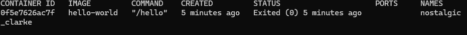

 Now after we've pull `hello-world` from the Docker Hub Registry, if we do 

 ```
 docker images
 ```

 We'll see that hello-world is now localled stored on our computer.

 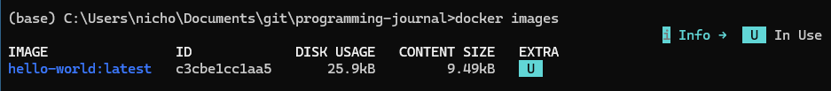

## Container and Image Architecture

**Docker Images**: A read-only immutable template. Any change will be creating a new image.

- A collection of file system layers. Layers are mutually exclusive, they only contain the differences of other layers inside the image. Example
    - Top Layer: application
    - Middle layer: env/libs
    - Bottom layer: a base Linux
- Separate layers are independent and can be reused.


**Docker Containers**: A writeable layer added to the image. Comes with container storage, i.e. local storage in the container.

Each container has a unique writable layer. This keeps containers isolated while using the same image.

## Demo: Working with existing docker images

- Pull `containerofcats` from Docker Hub

```bash
docker pull acantril/containerofcats
```

- Inspect the image to see
    - When it was created
    - Who created it
    - Description
    - Volumes
    - Entry point
    - Architecture/OS
    - Layers

```bash
# Last bit is the docker image, you can get it from running docker images
docker inspect 3ffa9b0efe79
```

- Run `containerofcats`

```bash
# -p: Specifies the to docker host 80 (image) to 8081 (local)
docker run -p 8081:80 acantril/containerofcats
```

Output:
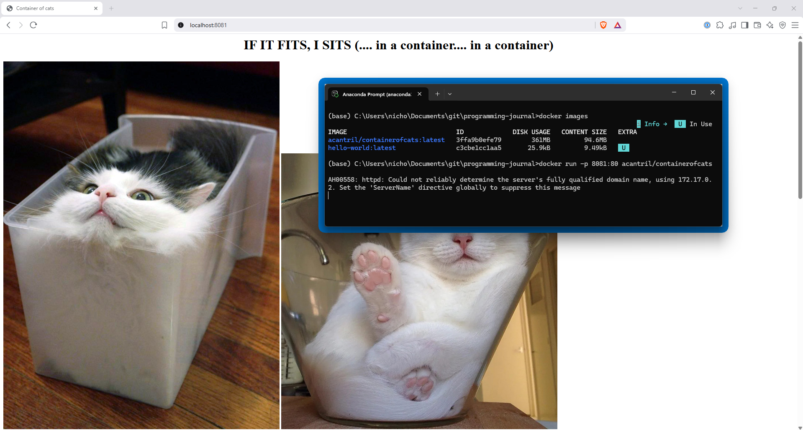

- Press `Ctrl-C` to exit the program; Use terminal command below to confirm that the program status is `Exited`

```bash
docker ps -a
```
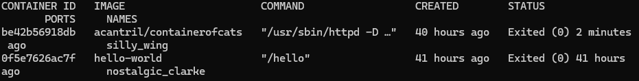

- Now we try doing `docker run` for `containerofcats` again, but detach the terminal, so that if we kill the process in the terminal, the docker container will still be running. To detach, we need to add the flag `-d`

```bash
# Run this command with the -d flag
docker run -p 8081:80 -d acantril/containerofcats

# Double check that your container is running
docker ps
```

- Copy down the container ID of `containerofcats` in the output of `docker ps`

```bash
# i.e. 8a2bba581eb2
```

- Run the following command to check the port mapping configuration.

```
docker port 8a2bba581eb2
```
Output: 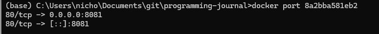

- Execute commands within the container
``` bash
# docker exec -it [YOUR_CONTAINER_ID] [YOUR_COMMAND]

# ps -aux: Command to see all processes running
docker exec -it 8a2bba581eb2 ps -aux
```
Note: If you get an error that `ps` executable file not found in $PATH, your WSL (assuming you're on windows) has no command called `ps`. So install the necessary packages.

``` bash
# Go into the container shell
docker exec -it 8a2bba581eb2 sh

# Install the necessary package
sh-4.4# dnf install -y procps-ng

# Exit the container's shell, bringing you back into your host OS's terminal
sh-4.4# exit

# Check if this command prints the running processes inside your container
docker exec -it 8a2bba581eb2 ps -aux
```

Output: 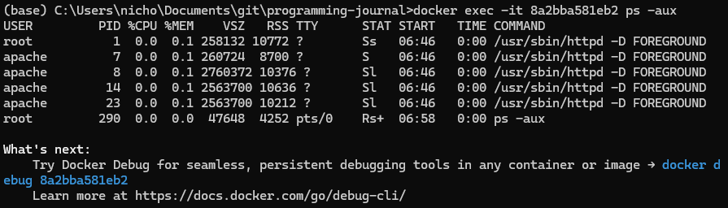


- Side note: If you run `df -k` inside the docker container shell, you can see the structure of your docker container's files.

- Other docker commands
```bash
# Restart the docker container
docker restart [YOUR_CONTAINER_ID]
docker stop [YOUR_CONTAINER_ID]
```

- To remove old containers that you've started up
```bash
# Remove container
docker rm [YOUR_OLD_CONTAINER_ID]

# Double check it's been removed
docker ps -a
```

- To remove old **images**
```bash
# Get the ID of your docker image
docker images

# Remove the image from your docker
docker rmi [YOUR_IMAGE_ID]
```

## Dockerfile Syntax

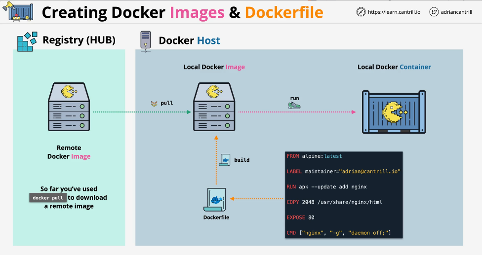

- `FROM`

    Sets the base image for a build (i.e. Alpine or Ubuntu)

- `LABEL`

    Adds metadata to an Image (e.e. description/maintainer)

- `RUN`

    Runs commands in a new layer (e.g. installs or configurations)

- `COPY`

    Copies NEW files/folders from src (client machine) to destination (new image layer)

- `ADD`

    Similar to `COPY` to add files.But has additional feature to add from a remote URL & do extraction etc (e.g. adding application/web files)

- `CMD`

    Sets the default executable of a container & arguments (e.g. web server)

    Can be override vai docker run parameters.

- `ENTRYPOINT`

    Similar to `CMD`, but **can't** be overridden.

    Creates single purpose image.

- `EXPOSE`

    Informs docker what port the container app is running on (metadata only! - no network configuration)


## [DEMO] Build and run a simple containerised application

Creating custom docker images using pre-prepared applications and Dockerfiles.

### App 1: `2048`
```dockerfile
FROM nginx:latest

LABEL maintainer="adrian@cantrill.io" 

COPY 2048 /usr/share/nginx/html

EXPOSE 80

CMD ["nginx", "-g", "daemon off;"]
```

- While inside the `./app1-2048` folder in your terminal, build a docker image.

```bash
# `-t` flag means tag: To assign a human-readable tag to your docker image
# `dockerized-2048` is the name of your image
# `.` Specifies the reference path for your `COPY` command in your Dockerfile
docker build -t dockerized-2048 .
```

- After the build finishes, check that your new image is inside your local images files

```bash
docker images
```

Output: You should see `dockerized-2048` added on top.

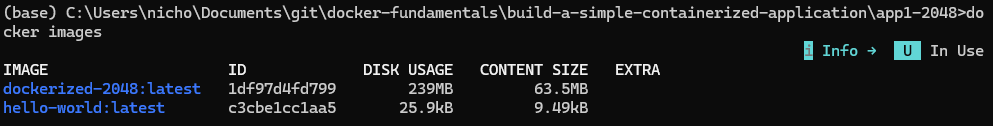

- Docker run your new image

    ```bash
    # -d: Detach terminal
    # -p: Specify port number
    docker run -d -p 8081:80 dockerized-2048

    # Verify your container is running
    docker -ps

    # Verify the port that `dockerized-2048` is running on.
    docker port [YOUR_CONTAINER_ID] # 80/tcp -> 0.0.0.0:8081
    ```

    Since the docker image is specified to run on port 80 `EXPOSE 80`, you need to docker run on that port. 

- Go to your web browser to check out the running game

Address: `localhost:8081` <- copy + paste into your web browser

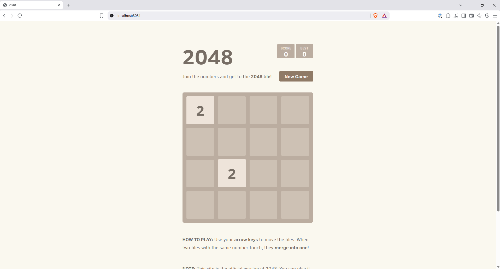

### App 2: `containerofcats`

Dockerfile (less efficient, uses a heavier image)

```dockerfile
FROM redhat/ubi8

LABEL maintainer="Animals4life"

RUN yum -y install httpd

COPY index.html /var/www/html/

COPY containerandcat*.jpg /var/www/html/

ENTRYPOINT ["/usr/sbin/httpd", "-D", "FOREGROUND"]

EXPOSE 80
```

- `RUN`: Installs the Apache 2 webserver
- `COPY`: The main web page `index.html`
- `COPY`: Wildcard to copy all the cat images.

^ Can copy one time only, but for educational purposes, two copies for less efficiency.

- Do a `docker build` while you're inside the app2 directory

```
docker build -t containerofcats .
```

Moral of the story: Select an appropriate base image to `RUN` for your application.

- Check that the build is completed
```bash
docker images
```

- `docker run`, match the exposed port
```bash
docker run -d -p 8081:80 containerofcats
```

- End the process

```bash
docker stop [YOUR_CONTAINER_ID]
docker rm [YOUR_CONTAINER_ID]
```

## Docker Storage - Writable Layer, Bind Mounts & Volumes

- Writable Layer

    Inside the layers of a docker image, any data that is written is added to a union of data layers called the 'writable layer'.

    The 'writable layer' has to be separate from the docker image, because the images are 'read-only'.

    This architecture requires a **file system driver** which has overhead and will impact performance.

- Container Storage

    - tmpfs (Fast / Host Memory)
        - Not persistent, can't be shared between containers
        - Usually for temporary or sensitive files

    - Bind mounts (A folder on your host system)
        - Multiple containers can access data on the host's filesystem. 
        - Might reduce portability because the filepaths are predefined.

    - Volumes (Like bind mounts, but managed by Docker)
        -  Outside the lifecycle of a container
        - Can be attached to multiple containers (no locking), so be careful to simultaneous changes to data in volume.

    
## Docker networking - modes and port exposure

- Host networking

    Suppose we begin with two hosts and two containers each.

    Con: Cannot run parallel instances of a container since you can only use one port at a time.

    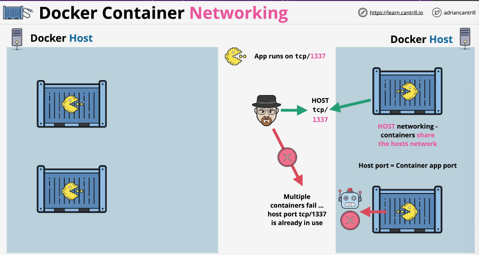

- Bridge networking

    - Containers are connected to a bridge network => Each container gets a private IP address on the bridge network SO THAT "unique private IP address + non-unique port" is still unique.

    - Containers can communicate with each other, since they're on the same bridge network. But cannot be reached outside of the bridge network. To gain access to the bridge network, we need to 'publish' or map a host port to a container port.

    - 'publish', `host:container`. Host-port-colon-container-port
    i.e. 
    ```
    -p 1337:1337
    -p 1338:1337
    ```

## [DEMO] Extending our container application using Environment Variables

- Run these command
```bash
# Create a container running the `phpadmin` DB management application
docker run --name phpmyadmin -d -p 8081:80 -e PMA_ARBITRARY=1 phpmyadmin/phpmyadmin

# Pull down the mariaDB image
docker pull mariadb:10.6.4-focal
```
- Environment variables allow you to use commands as long as you provide the filepath to where that command should do. If you inspect an image, like the `mariadb` one, you'll see under `"Env"` that there are different env variables.
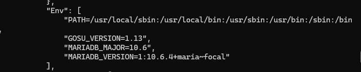

- Convention dictates that environment variable names are all-caps, and the values are in small letter.s

- To add environment variables using docker in the command line:

```bash
# -e: Specifies the environment variable name and the filepath
docker run --name db -e MYSQL_ROOT_PASSWORD=somewordpress -e MYSQL_PASSWORD=wordpress -e MYSQL_DATABASE=wordpress -e MYSQL_USER=wordpress -d mariadb:10.6.4-focal --default-authentication-plugin=mysql_native_password

# Check that mariadb is running
docker ps
```

- Check that the environment variables you specified in that long command above are added do a `docker inspect`

```bash
docker inspect [YOUR_ENVIRONMENT_ID]
```

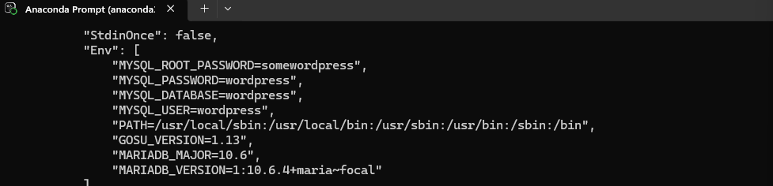

- While the db applications are running, you can go to `localhost:8081` and log into the database GUI.

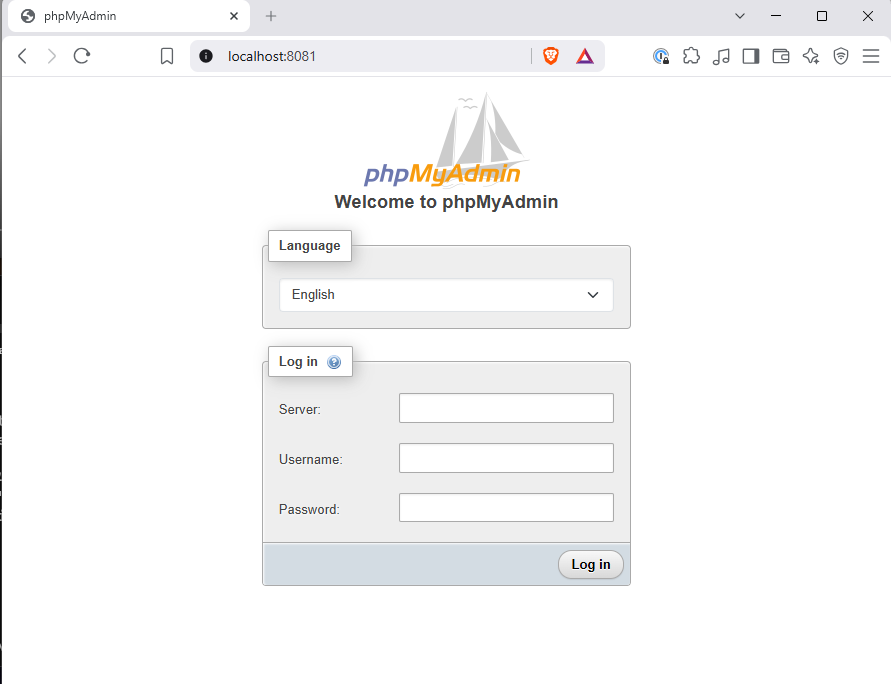

```bash
Server: 172.17.0.3 # taken from the inspect results under IP address
Username: root
Password: somewordpress # as defined in MYSQL_ROOT_PASSWORD of the new Env variable
```

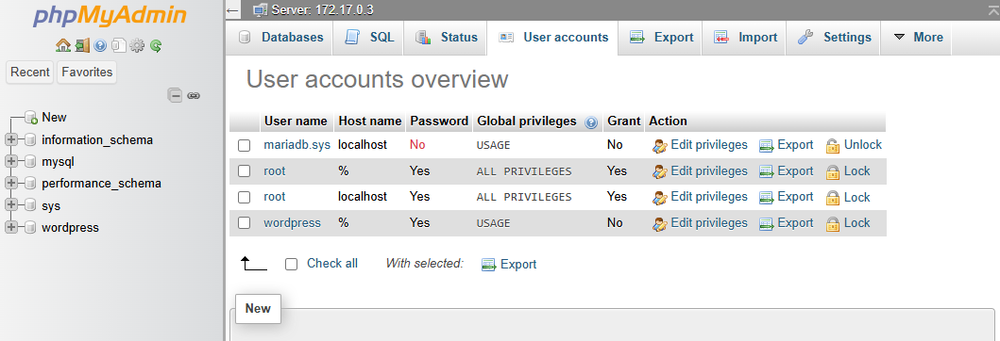


- Go into the `db` container's bash (terminal)

```bash
docker exec -it db bash

# Do `df -k` to list all the drives and volumes that are mounted. You'll see there are no external mounted drives. If the container is deleted, so is the storage
root@ff87dcab6892:/# df -k

# ^ An example of tmpfs
```

## [DEMO] Docker Bind Mounts & Volumes

[notes for this demo](https://github.com/acantril/docker-fundamentals/blob/main/docker-container-volumes/instructions.md)

### Bind Mounts

- Run this
    ```bash
    docker run --name phpmyadmin -d -p 8081:80 -e PMA_ARBITRARY=1 phpmyadmin/phpmyadmin
    ```

- Recall that bind mounts map a file/directory on the host machine (local) onto one in the container. To note: This usually creates some problems in Windows.

- Navigate to your home folder

- Create a new folder 
    ```
    mkdir mariadb_data
    ```

- In your home folder run this command (Windows) For the macOS / Linux see notes link above

    ```
    docker run --name db -e MYSQL_ROOT_PASSWORD=somewordpress -e MYSQL_PASSWORD=wordpress -e MYSQL_DATABASE=wordpress -e MYSQL_USER=wordpress --mount type=bind,source=%cd%/mariadb_data,target=/var/lib/mysql -d mariadb:10.6.4-focal --default-authentication-plugin=mysql_native_password
    ```

    ^ The code above runs a container with the configuration of a few environment variables.

- Now check that your `mariadb_data` folder has been populated from the above command

    ```
    cd mariadb_data
    dir
    ```

- To remove a folder on Windows terminal

    ```
    rmdir /s /q "[YOUR_RELATIVE_OR_ABOSOLUTE_FILEPATH]"
    ```

### Volumes

The preferred way to manage data (writable layer) outside of container's lifecycle. Managed end-to-end by Docker.

If you delete a container, this volume continues to exist.

- To create a volume
```
# docker volume create [YOUR_VOLUME_NAME]
docker volume create mariadb_data
```

- Double-check that your volume has been correctly created
```bash
# Check the volume exists, via its name
docker volume ls

# Check the volume metadata
# docker volume inspect [YOUR_VOLUME_NAME]
docker volume inspect mariadb_data
```

- To remove a volume
```bash
# docker volume rm [YOUR_VOLUME_NAME]
docker volume rm mariadb_data

# Double check the volume has been deleted 
docker volume ls
```

Docker volumes are created when: 
1. You use the `docker volume create` command 
2. You specify in the `RUN` command of your Dockerfile

- Mount a volume `(--mount)`

    ```bash
    docker run --name db -e MYSQL_ROOT_PASSWORD=somewordpress -e MYSQL_PASSWORD=wordpress -e MYSQL_DATABASE=wordpress -e MYSQL_USER=wordpress --mount source=mariadb_data,target=/var/lib/mysql -d mariadb:10.6.4-focal --default-authentication-plugin=mysql_native_password
    ```

- Check the new volume has been created via the long command above

    ```bash
    docker volume ls

    # Even if you `docker stop db`
    docker stop db

    # You will still see the `mariadb_data` volume 
    docker volume ls
    ```

To note: If you run a command that creates a data with the new command, it will just use the existing data folder.

## Docker Compose

Create, manage and cleanup multi-container applications.

- Reads a "docker compose file", "compose.yaml"

- Creates, updates or deletes based on that file. (Containers, networking, volumes...)

- `docker compose up`

    Instructions sent up to the Docker Daemon, to run/update containers, volumes and networks.

## [DEMO] Using Docker Compose with our application

[notes for this demo](https://github.com/acantril/docker-fundamentals/blob/main/docker-compose/instructions.md)

- Make sure the tabs are converted to spaces

- Run a `docker compose`
    ```bash
    # up: Tell docker compose to bring up the things in the compose file
    # -d: Runs it detached from the terminal
    docker composer up -d
    ```

- Per the `compose.yaml` instructions, you would've created two new volumes

    + `[YOUR_USERNAME]_mariadb_data`
    + `[YOUR_USERNAME]_wordpress_data`

- Double check these volumes are created

    ```bash
    docker volume ls
    ```

On `localhost:8081`, you should see the wordpress installation screen.

^ Because the .yaml file specified the port to be `8081:80`

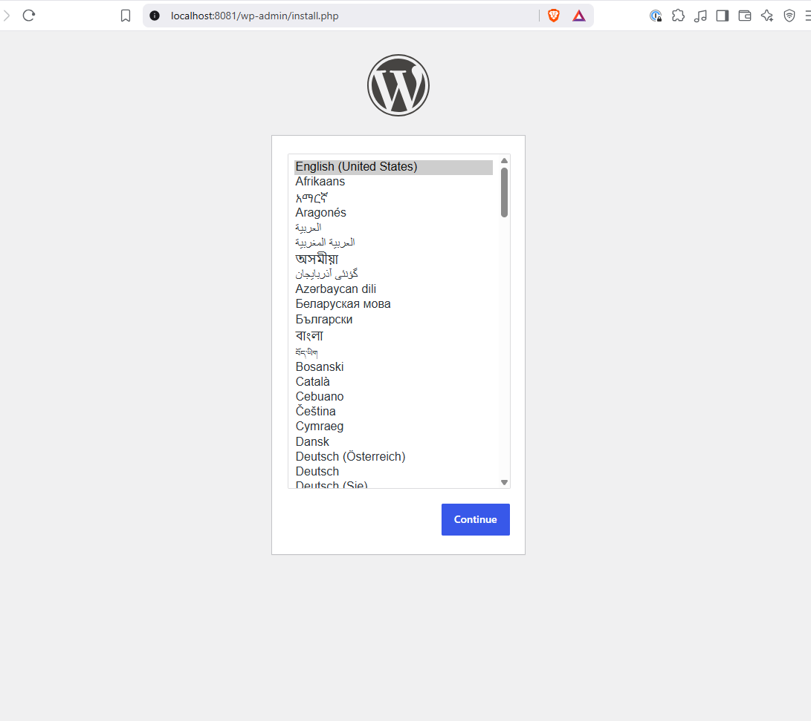

Pass: Y)Ccegv75J)BVsPrPJ

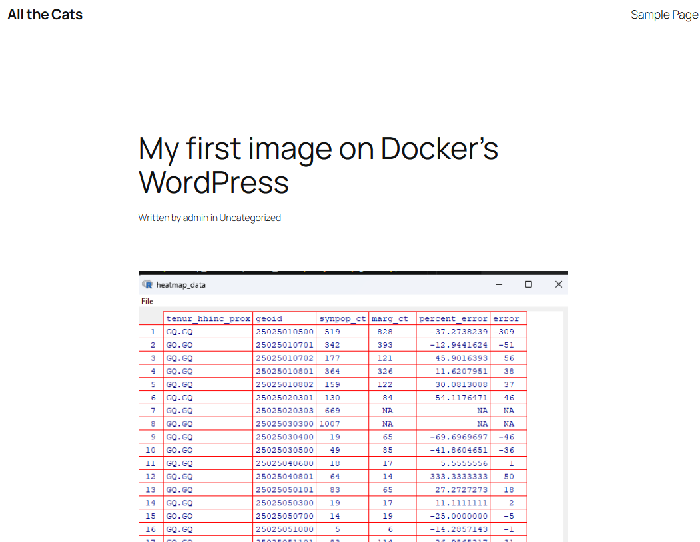

- Remove containers defined in the `yaml` file

    ```bash
    docker compose down
    ```

    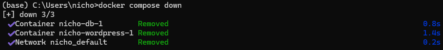


