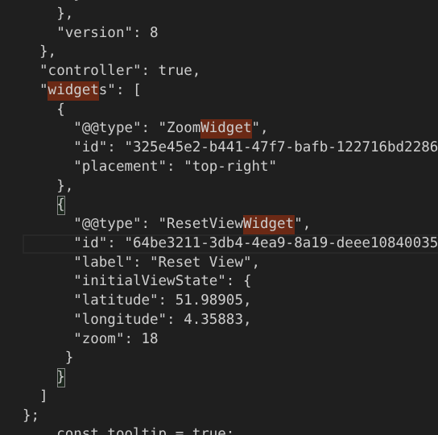

# 1. GNU/Linux
> Most of the advice I give here are for Pop!_OS since I've really only daily driven this distro. I guess the commands work for Ubuntu based distros.

## 1.1. Removing folder
* rm - remove
* rf - recursively
```
sudo rm -rf YOUR_FOLDER_PATH
```
## 1.2. `.bashrc` and `.bash_profile`
A `.bashrc` file contains your customisation to your command-lin environment. You use `.bashrc` to make settings in every new terminal.

`.bash_profile` is for settings that you only need to run once at login.

To apply new changes to your terminal use the command

```
source ~/.bashrc
```

Remarks:
- Bash stands for 'Bourne-Again SHell', supposedly a pun on the author of a previous Unix shell.

# 2. Emacs

## 2.1. TODO Writing a custom function/mode that modifies my schedule time

# 3. org-mode & org-roam

# 4. VS Code
## 4.1. Shortcuts
- Move to left, right workspace
  + Ctrl+K Ctrl+Right Arrow
  + Ctrl+K Ctrl+Left Arrow

## Solved issues
- **Problem:** On my pop os machine, I could not do select multiple lines using the `Ctrl` + `Shift` + `↑/↓` shortcuts,
  because there was a conflicting keyboard shortcut called `notebook.focusPreviousEditor`
  + **Solution**: Disable the notebook shortcut by going to "Command Palette" > Search for
  search for the conflicting shortcut > Right Click to disable it.

# 5. Python

```
%load_ext autoreload
%autoreload 2
```

## 5.1. Guides to Python virtual environments

### 5.1.1. Links to guides

[Bowman](https://dev.to/bowmanjd/python-tools-for-managing-virtual-environments-3bko)

[Bennet](https://www.b-list.org/weblog/2022/may/13/boring-python-dependencies/)

#### 5.1.1.1. Bowman
- Creating a virtual environment with the `venv` module
  - In your terminal: `python -m venv .venv`
  - You can replace `python` with the specific Python version you need for your virtual environment, i.e. `python3.9 -m venv .venv`
  - Sidenote: The `-m` stands for module name.

- Activating and deactivating `vnenv`s 
  - Activating
    - Unix: `source ./venv/bin/activate`
    - Windows: `.\venv\Scripts\Activate.ps1`
  - Deactivating
    - Both: `deactivate`
  - Removing a virtual environment
    - `rm -r .venv`
- `virtualenv` is an expanded version of `venv` that is faster and has more features.

`poetry` handles

1. virtual environments
2. project and dependency management

 By default `poetry` will put the virtual env in another central location outside of the project folder. You can choose to change this and put the virtual env inside the folder with this command
  
```
poetry config virtualenvs.in-project true
```

Steps to create a new `poetry` environment

1.  Inside your desire directory run
```
poetry new YOUR_PROJECT_NAME
```

2. To activate the virtual environment do
```
poetry shell
```

3. To exit the virtual environment do
```
poetry shell
```

If you want to run Python in your terminal within the virutal environment of your project do

```
poetry run python
```

- To add a package in `poetry` do
```
poetry add YOUR_PACKAGE_NAME
```

#### 5.1.1.2. Bennett


## 5.2. Recreating your broken virtual environment

> Context: So on Feb 2026, I tried to create a Windows virtual machine on my Pop!_OS machine while I was working at NUS Cities. I needed access to some Microsoft office features. That didn't go so well. I ended up partitioning my storage, and in attempt to fix that, I messed up the bootloader. I actually expanded the storage which absorbed the bootload and the recovery partitions in my SSD.

1. If you're on a relatively fresh install of your OS, get `pipreqs`

```
pip install pipreqs
```

2. If you're ok overwriting your old requirements.txt use the `--force` flag also
```
pipreqs [your directory] --force 
```

i.e. 
```
pipreqs /home/nicholas/git/django_map/ --force 
```

If you hit an error like being unable to read your old venv files, make sure you get pipreqs to ignore those folders

```
python3 -m pipreqs.pipreqs /home/nicholas/git/django_map/ --ignore django_map,venv
```

Full list of `pipreq` flags, taken from the [repo](https://github.com/bndr/pipreqs) README:

```
Usage:
    pipreqs [options] [<path>]

Arguments:
    <path>                The path to the directory containing the application files for which a requirements file
                          should be generated (defaults to the current working directory)

Options:
    --use-local           Use ONLY local package info instead of querying PyPI
    --pypi-server <url>   Use custom PyPi server
    --proxy <url>         Use Proxy, parameter will be passed to requests library. You can also just set the
                          environments parameter in your terminal:
                          $ export HTTP_PROXY="http://10.10.1.10:3128"
                          $ export HTTPS_PROXY="https://10.10.1.10:1080"
    --debug               Print debug information
    --ignore <dirs>...    Ignore extra directories, each separated by a comma
    --no-follow-links     Do not follow symbolic links in the project
    --ignore-errors       Ignore errors while scanning files
    --encoding <charset>  Use encoding parameter for file open
    --savepath <file>     Save the list of requirements in the given file
    --print               Output the list of requirements in the standard output
    --force               Overwrite existing requirements.txt
    --diff <file>         Compare modules in requirements.txt to project imports
    --clean <file>        Clean up requirements.txt by removing modules that are not imported in project
    --mode <scheme>       Enables dynamic versioning with <compat>, <gt> or <non-pin> schemes
                          <compat> | e.g. Flask~=1.1.2
                          <gt>     | e.g. Flask>=1.1.2
                          <no-pin> | e.g. Flask
    --scan-notebooks      Look for imports in jupyter notebook files.
```

## 5.3. Creating a `requirements.txt` file for your repo

1. Make sure you have `pipreqs` isntalled in your venv
2. Run this in your terminal
```
pipreqs YOUR_REPO_PATH
```

If you need to overwrite an existing `requirements.txt`, do

```
pipreqs YOUR_REPO_PATH --force
```

If you want to ignore scanning certain directories, use the ignore flag, add directories you want to ignore, each sparated by a comman
```
pipreqs YOUR_REPO_PATH --ignore IGNORED_DIR_0, IGNORED_DIR_1
```

## 5.4. Installing packages from `requirements.txt`
```
pip install -r /path/to/requirements.txt
```

## 5.5. Installing other Python versions

## 5.6. Wrapping up Python repo to ensure it runs on another machine
### 5.6.1. Poetry
* Poetry is a dependency management and packaging tool in Python. 
* Helps you tell yourself (and the world) what libraries your project uses and it will maange (isntall/update) them for you.
* Lockfile - A feature that ensures repeatable installs, and helps you build your project for distribution.

## 5.7. TODO Creating a proper Python project file structure
- Time for me to learn a standard, industry way to structure
  my Python directory

## uv

Installing `uv` to your machine (taken from [this Medium article](https://medium.com/@hmbarotov/configuring-a-django-project-with-uv-548f15ccbc63))
```
# MacOS / Linux
$ curl -LsSf https://astral.sh/uv/install.sh | sh

# Windows
$ powershell -ExecutionPolicy ByPass -c "irm https://astral.sh/uv/install.ps1 | iex"
```

Run this to verify installation
```
$ uv --version
```

Initialising your project directory with `uv`, auto-dls the Python version
you specified.
```
uv init --python 3.12
```

Things created when you `uv init` + `uv run`
- .git
- .venv: This is where your project's dependencies will reside (virtual environmment)
- .gitignore
- .python-version
- pyproject.toml: Contains meta data about your project
- README.md
- src

Run your project's Python instance
```
uv run python
```

Adding packages via `uv`
```
uv add Django
```
*Remark: `uv` takes note of all the dependencies arising from top-level packages.
i.e. Django's dependencies - `asgiref`, `sqlparse` etc.

**`uv` update workflow**
1. `uv init`" Create a new Python project
2. `uv add [YOUR_PYTHON_PACKAGE]`: Add dependency
3. `uv remove` : Remove depedency
4. `uv lock`: Update your lock file without changing existing dependencies
5. `uv run`: Run a command using the project env
6.


**Restoring the Python environment**
You'll need

- `pyproject.toml`
- `uv.lock`

copy + pasted, then run `uv sync`.


**Running `uv` in a project folder**

Step 1: Create virtual environment

```
uv venv
```

Step 2: Activate virtual environment

```
source .venv/bin/activate
```

Step 3: (Optional) Install from pyproject.toml file
```
```

You can group dependencies by adding a `--group` flag to say which group.

Examples of groups (I'll probably only need dev and prod)
* base
* dev
* prod

Pre-fork worker model to handle traffic spikes to your website. Used in prod mostly.
```
uv add --group prod gunicorn
```

For example, if you only want to use the debug toolbar in dev only.
```
uv add --group dev django-debug-toolbar
```
Then once you're happy with the state of packages you've added, do
```
uv sync
```
The uv sync command will:

1. Find or download an appropriate Python version.
2. Create and set up your environment in the .venv/ folder.
3. Build your complete dependency list and update the uv lock file.
4. Install your project dependencies into the virtual environment.

*If you're using Django, start your terminal commands
with uv. i.e.
```
uv run manage.py startapp map
```

## Conda environments

Had to learn this because I wanted to use osmnx which works better when installed on conda.

1. Download the conda install, `.sh` file
  
I downloaded miniconda, because I wanted something lightweight, and would not disrupt my other Python environments.

2. Install conda from the `.sh` file, by running the following in your terminal.
```
bash <conda-installer-name>
```
3. Add the installed conda to your environment paths
```
export PATH=~/miniconda3/bin:$PATH
```
> Remark: You can switch `miniconda3` to whatever you installed, i.e. if it's `anaconda3`, 
> then replace the miniconda3 with that accordingly.

4. Create a new virtual environment
```
conda create -n YOUR_VENV_NAME
```

5. Conda init in your working directory
```
# In your project's working directory
conda init
# You'll be asked to restarted your shell (for Linux)
```

6. Now you can activate your new venv in your project directory
```
conda activate YOUR_VENV_NAME
```

To remove a virtual environment
```
conda env remove -n myenv
```


# Git

# Setup

1. Setup your identity
```
$ git config --global user.name "John Doe"
$ git config --global user.email johndoe@example.com
```

2. Confirm global configs
```
git config user.name
git config user.email
```

## Deleting local and remote branches
```
git push -d <remote_name> <branchname>   # Delete remote
git branch -d <branchname>               # Delete local
```

## Reset to previous remote status
`git reset --hard`

## How to remove folder from git tracking

Step 1. Add the folder path to your repo's root .gitignore file.
path_to_your_folder/

Step 2. Remove the folder from your local git tracking, but keep it on your disk.
git rm -r --cached path_to_your_folder/

Step 3. Push your changes to your git repo.

## How to see your tracked files

```
git ls-files
```

## Check what is git ignored
`git status --ignored`


Tip: To ignore a folder do 
`YOUR_FOLDER_NAME/`


## Fresh start, remove big files from local history
1. Reset your history to match GitHub:

```
git reset --soft origin/main
```

This command "undoes" those 8 commits. Your code stays exactly as it is, but all the changes become "staged" (green) again.

2. Unstage the big files:

```
git reset
```

This moves everything to "untracked" (red). Now, because your .gitignore is working, the big folders (tgm, manley23/data) will simply disappear from Git's view.

3. Create one clean, small commit:

```
git add .
git commit -m "Fresh start: excluding all large data and venv files"
```

Push the clean version:

```
git push
```

## git force local to match remote

```
# 1. Download latest data from remote
git fetch origin

# 2. Force reset current branch to match remote
git reset --hard origin/main
```

# 6. Docker

https://learn.cantrill.io/p/docker-fundamentals


## Windows

**Step 1**: Install WSL
```
wsl --install Ubuntu --web-download
```


**Step 1.5**: Launch `wsl`, and update packages with this command
```
# Before that you will have to fill in a username and password
sudo apt update
```


**Step 2**: Download and install Docker Desktop from [this link](https://docs.docker.com/desktop/setup/install/windows-install/).

**Step 3**: Launch Docker Desktop once, sign in and close it once you are on the homepage. 

Docker Desktop consumes wayy to much RAM. We will proceed with the CLI.

**Step 4**: Check the `docker` command works in your command prompt with this command
```
docker --version
```


# 7. GIS

## GDAL
What is it??

# R

## Adding R to permanent path on Windows (Linux > Windows btw)
```
# Replace the filepath with your own R install filepath
setx PATH "%PATH%;C:\Users\nicho\R-4.6.1\bin"
```

## Debugging
```
debugSource(YOUR_FILE_PATH)
```

If your RStudio's console is stuck in the browser, i.e. `Browse[1]`, here's how to exit:

- `f` > `Q`

## Restarting a frozen R session
- In RStudio, Session > Restart R

# Insert Chunk for VS Code
- Inside your keyboard shorcuts JSON of your VS Code, add this

```JSON
// Place your key bindings in this file to override the defaults
[
    {
        "key": "ctrl+shift+i",
        "command": "editor.action.insertSnippet",
        "when": "editorTextFocus",
        "args": {
            "snippet": "```{r}\n\$\n```"
        }
    }
]
```

# 7. Unfiled Things

## Julia X Gurobi
- If you get an error that no Gurobi license is found, make sure you've copied the license file in the right place.
- [Link to help page on where to put your license file](https://support.gurobi.com/hc/en-us/articles/360013417211-Where-do-I-place-the-Gurobi-license-file-gurobi-lic)

## pydeck
- Reset view in `pydeck` doesn't work, go into the html output and add this line above the widget configuration.
```
"controller": true
```




- To use map markers, you need to upgrade to webgl v9.3  or higher
```html
<script src='https://cdn.jsdelivr.net/npm/@deck.gl/jupyter-widget@~9.3.*/dist/index.js'></script>
<link rel="stylesheet" href=https://cdn.jsdelivr.net/npm/@deck.gl/widgets@~9.3.*/dist/stylesheet.css />
```


## 7.1. Pyenv error message - What's a load path?

```
WARNING: seems you still have not added 'pyenv' to the load path.

# Load pyenv automatically by appending
# the following to 
# ~/.bash_profile if it exists, otherwise ~/.profile (for login shells)
# and ~/.bashrc (for interactive shells) :

export PYENV_ROOT="$HOME/.pyenv"
[[ -d $PYENV_ROOT/bin ]] && export PATH="$PYENV_ROOT/bin:$PATH"
eval "$(pyenv init - bash)"

# Restart your shell for the changes to take effect.

# Load pyenv-virtualenv automatically by adding
# the following to ~/.bashrc:
```

```
eval "$(pyenv virtualenv-init -)"
```

# R

## R Notebook Boilerplate
```R
knitr::opts_chunk$set(echo = TRUE, message = FALSE, warning = FALSE)

# IF NECESSARY: Change root dir to whatever you want
knitr::opts_knit$set(root.dir = "../../")
```

## Setting up R for VSCode

For Windows, Linux guide coming soon

1. Make sure you've installed R from cran.r-project (Note: RStudio does not come with an R.exe)

2. Add R to your permanent path on Windows 

```
# Replace the filepath with your own R install filepath
setx PATH "%PATH%;C:\Users\nicho\R-4.6.1\bin"
```
3. Install the VS Code extensions

  1. R
  2. R Debugger

5. Using the R Termina; (type `R` into cmd prompt), install `languageserver` package
```R
install.packages("languageserver")
```

6. In VSCode, open user settings, copy this in
```JSON
{
    "files.associations": {
        "*.Rmd": "rmd"
    },
    "r.plot.useHttpgd": true,
    "r.bracketedPaste": true,
    "r.rterm.windows": "C:/Users/nicho/anaconda3/Scripts/radian.exe",
    "r.useRenvLibPath": true,
    "r.notebook.executeInTerminal": true,
    "r.alwaysUseActiveTerminal": true,
    "rdebugger.rpath": "C:/Program Files/R/R-4.6.0/bin/x64/R.exe",
    "rdebugger.timeouts.startup": 10000,
    "r.debugger.timeouts.startup": 10000,
    "r.rpath.windows": "C:/Users/nicho/R-4.6.1/bin/R.exe",
    "terminal.integrated.commandsToSkipShell": [
        "language-julia.interrupt"
    ]
}
```
7. Get radian; In your conda prompt
```Python
pip install -U radian

# Look for where radian is
where radian.exe

# Copy and paste radian in the user settings above
```

8. Install renv
```R
# Open r terminal in your VSCode
install.packages("renv")
```

9. `renv` workflow
Note: Do the initialisation using R via command prompt to make sure you're in the right directory.

Make sure you're in the root directory before you launch an R interactive window

- renv::init(): Initalise renv in an existing project
- renv::install(): Install new packages
- renv::update(): Update packages
- renv:: snapshot(): Record packages and their sources in the lockfile
- renv::restore(): Reinstall specific package versions, when you pass your code to a collaborator.

10. To run files in R Interactive Terminal
```R
source("YOUR_FILENAME.R")
```

11. Install the vscDebugger package from the repo
```R
install.packages("vscDebugger", repos = "https://manuelhentschel.r-universe.dev")

# May need to manually install
install.packages("jsonlite", "R6")
```

12. If still cannot debug, run this in the command palette:
```
r.debugger.updateRPackage
```

13. Add this to your VSCode keyboard shortcut JSON file to insert R chunk in .Rmd files

```
[
    {
        "key": "ctrl+shift+i",
        "command": "editor.action.insertSnippet",
        "when": "editorTextFocus",
        "args": {
            "snippet": "```{r}\n\$\n```"
        }
    }
]
```

14. Add this to your `.RProfile` so you can get watch your environment variables
```R
# .RProfile
is_background_daemon <- !interactive() && (
  identical(Sys.getenv("R_DAEMON"), "TRUE") ||
  !is.null(getOption("callr.condition_handler_env")) ||
  identical(Sys.getenv("CALLR_CHILD_SESSION"), "1")
)

is_rmd_chunk <- !interactive() && !is_background_daemon && (
  any(grep("rmarkdown|knitr", commandArgs(trailingOnly = FALSE))) ||
  any(vapply(c("rmarkdown", "knitr"), isNamespaceLoaded, logical(1)))
)

if (is_background_daemon) {
  # Strict fast exit

} else {

  if (file.exists("renv/activate.R")) source("renv/activate.R")

  options(vscodeR = TRUE)

  vsc_init <- list.files(
    file.path(Sys.getenv("USERPROFILE"), ".vscode/extensions"),
    pattern = "^init\\.R$",
    recursive = TRUE,
    full.names = TRUE
  )
  vsc_init <- vsc_init[grepl("reditorsupport\\.r-", vsc_init)][1]

  if (!is.na(vsc_init) && file.exists(vsc_init)) {
    source(vsc_init, chdir = TRUE, local = FALSE)
    if (exists(".First.sys", envir = globalenv())) {
      .First.sys()
    }

    if (interactive()) {
      message("VS Code Session Watcher: Interactive Environment Connected.")
    } else if (is_rmd_chunk) {
      message("VS Code Session Watcher: Rmd Notebook Chunk Connected.")
      if (requireNamespace("knitr", quietly = TRUE)) {
        knitr::opts_knit$set(envir = .GlobalEnv)
      }
    }
  }

  if (interactive()) {
    options(radian.auto_match = FALSE)
    options(radian.auto_indentation = FALSE)
    options(radian.complete_while_typing = FALSE)
  }
}
```

## Using the `box` library to modularise your code

Examples:

```R
box::use(
  utils[read.csv, write.csv],
  dplyr[...]
  tidyr[...]
  here[...],
  ./plot_maps #Custom R package
)
```

## Using `here()`

- Tell R where is the path to the current file starting from the project root

  ```R
  # Project Root: Parent folder of SRC
  # Current file: synthpop.R
  # here::i_am("src/r/synthpop.R")
  here::i_am("YOUR_REFERECE_POINT_DIR") 
  ```

- Specifying another dir relative to your reference point

  ```R
  # my_str: rds_data
  my_dir <- paste0(here("data", "output_data", my_str, "/"))

  # project_root/data/output_data/rds_data/
  ```


[Video guide to configure VSCode to run R.](https://www.youtube.com/watch?v=rKPfssR66GM)

## Adding R kernel to Jupyter

Step 1: Install R kernel

```
# Inside your R console run
install.packages('IRkernel')
```

Step 2: Link it to your Jupyter 
```
Rscript -e "IRkernel::installspec(user=TRUE)"
```

```R
# Sample R code to run
example <- 123

example_data <- data.frame(
    ID = 1:10,
    Age = sample(18:50, 10, replace=TRUE),
    Score = round(runif(10, 50, 100), 1)
)

print(example_data)

hist(example_data$Age,
    main = "Histogram of Ages",
    xlab = "Age",
    ylab = "Frequency", 
    col = "lightblue",
    border = "black"
)
```

## `renv`
https://rstudio.github.io/renv/articles/renv.html


# Obsidian + Git

Once you created a new vault in your `git` folder:
- Git add, commit and push
- Then run the following commands

```bash
# The command given in the empty remote repo
```

```bash
git remote set-url origin [YOUR_REMOTE_URL]
```